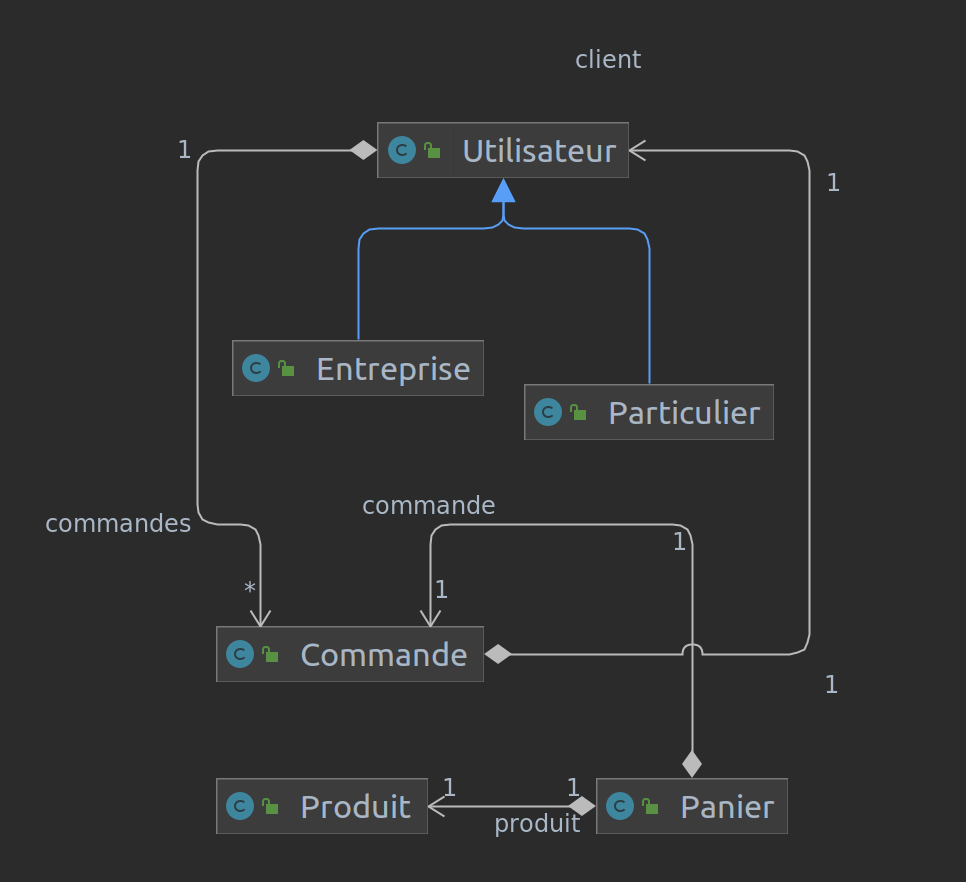

# Spring Boot REST API Example

Sample project demonstrating configuration and usage of Spring Data Rest and Spring Security framework


## Used Core Libraries

- [Spring Boot](https://spring.io/projects/spring-boot)
- [Spring Data](https://spring.io/projects/spring-data)
- [Spring Data REST](https://spring.io/projects/spring-data-rest)
- [spring-security](https://spring.io/projects/spring-security)
- [mapstruct](https://mapstruct.org)

## Project Demonstrates

- Spring Data Configuration
- Spring Data REST Configuration
- Spring Security Configuration
- [JWT](https://jwt.io) Based Stateless Authentication
- Role Based Authorization

## What it will look like

<a href="docs/diagramme_de_classe.png" target="_blank">

</a>


### Lancer l'application en local

1- Clone le projet

```Shell
git clone https://github.com/bangaromaric/restfull-springboot.git
```

2- Build

```Shell
cd demat
mvn clean install
```

3- Run

```Shell
java -jar target/restfull-0.0.1-SNAPSHOT.jar
```
